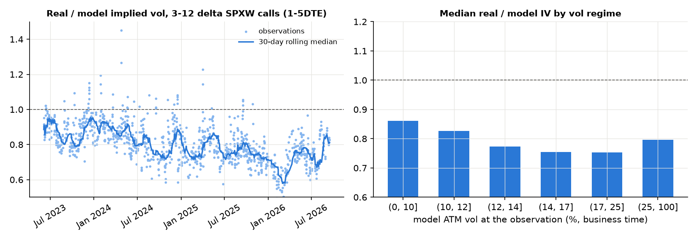

# SG_UFLY: Upside Vol Premium backtest (short-dated far-OTM SPX calls)

A simulation of a systematic **upside volatility premium** strategy:

> On every roll date the strategy sells deep OTM **1-delta to 10-delta calls** across four
> short-dated listed expiries (**2, 3, 4, 5 DTE**) and **delta-hedges every hour**. Calls are
> **held to maturity**.

- **Original design:** 25% on each expiry and equal weight on each strike.
- **Tilted design:** 80% of strike notional on 5–10-delta and 70% of roll notional on 4–5DTE.

Backtest window: **Jan 2011 – Sep 2026**. Option pricing is **calibrated to real SPXW prices**
(Barchart history from Jun 2023, plus CBOE, Yahoo and Barchart chain snapshots).


## Bottom line

| Evidence | Tilted strategy Sharpe |
|---|---:|
| First backtest (v1, assumed wing) | 4.2 |
| Backtest priced off the 22 Sep 2026 chain (a rich-wing day) | 5.5 |
| **Backtest calibrated to real SPXW prices, 2011–2026** | **1.5** |
| Backtest, Jun 2023 – Sep 2026, wing priced day by day from real prices | 1.4 (1.3 on real hourly bars only) |
| Same window, selling only when the wing is rich (top third) | **2.0** |
| Real trades (sold at 5DTE, hedged at each daily close) | 0.9, in line with the backtest's once-a-day-hedged variants |

The upside vol premium exists, but it's a **Sharpe ~1.5 strategy with a fat overnight-gap tail**,
not the Sharpe 5–6 the earlier versions showed. They were too good because the call wing was
priced about 20% too rich in vol terms (about 3x in price).

## What the real prices (Barchart) showed

Barchart keeps daily OHLC, volume and open interest for **expired** SPXW contracts from about
**late May 2023**. `validate_history.py` sampled an expiry every 5 trading days
(Jun 2023 – Sep 2026, 165 expiries):
- 495 wing contracts, at the strikes the strategy would sell at 5DTE (5 / 7.5 / 10 delta);
- 165 ATM contracts.

Each contract was compared with the model on every day from 5DTE to 1DTE.



| Check | Result |
|---|---|
| 5–10-delta calls, real vol / model vol (22 Sep chain-calibrated) | **0.80** median (IQR 0.74–0.88), n = 1,053; real price about 1/3 of the model's |
| Same, after calibration (wing × 0.82) | 1.006 median (IQR 0.92–1.10) |
| ATM calls, real vol / model vol | **1.02**: ATM pricing (VolVue SPXW + short end) was already right |
| Wing richness over time | 0.93 (2023H1) → 0.72 (2026H1), back to about 0.85–1.0 in Sep 2026 |
| Wing by vol regime | Cheaper when vol is high (0.86 at ATM < 10%, 0.75 at 14–25%) |

Barchart's bars were checked against the chain snapshots of 22 and 23 Sep 2026. The closes
agree with the snapshot mids to within a few percent, so the timing is right. The 22 Sep chain,
used for the earlier calibration, was a rich-wing day, after SPX rallied to record highs.

**Real-price mini-backtest.** Each sampled contract is sold at its real 5DTE close (less a 3%
half-spread), hedged at each daily close, and held to expiry:

| | Real prices | Model (calibrated) | Model (22 Sep pricing) |
|---|---:|---:|---:|
| Average premium, bp of notional | 2.7 | 2.9 | 7.1 |
| Average P&L after hedging, bp | 1.3 | 1.6 | 6.7 |
| Sharpe, one expiry per week | 0.9 | 1.3 | 3.8 |
| Worst expiry, bp | −162 | −113 | −52 |

**Selling only when the wing is rich works in real trades.** Tercile of wing richness at the
sale date (real vol / model vol, observable when you trade):

| Wing at sale | Average P&L per expiry | Sharpe | Worst |
|---|---:|---:|---:|
| Cheap (median 0.71) | −3.6 bp | −1.0 | −162 bp |
| Middle (0.80) | +1.3 bp | 0.4 | −116 bp |
| **Rich (0.90)** | **+12.1 bp** | **3.2** | −43 bp |

Richness persists: the week-to-week autocorrelation is 0.71.

## Backtest results (pricing calibrated to real prices)

Returns are excess returns. "1x" sells 1x NAV of notional per daily roll. "Ret @5% vol" scales
each row to 5% annualised vol.

| Scenario, 2011–2026 | CAGR % | Vol % | Sharpe | Ret @5% vol | Max DD % | Worst day % |
|---|---:|---:|---:|---:|---:|---:|
| **Tilted** (hourly hedge) | 3.7 | 2.4 | **1.53** | 7.7 | −4.5 | −1.9 |
| Tilted, scaled 2.5x (~6% vol) | 9.3 | 5.9 | 1.54 | 7.7 | −11.1 | −4.7 |
| Low-delta tilt (80% on 1–5-delta) | 2.7 | 1.5 | 1.73 | 8.7 | −2.9 | −1.2 |
| Concentrated (5–10-delta, 4–5DTE only) | 5.4 | 3.0 | 1.77 | 8.8 | −5.3 | −2.3 |
| Equal weights (original design) | 2.6 | 1.9 | 1.36 | 6.8 | −3.8 | −1.6 |
| Tilted, hedged once a day | 0.8 | 3.7 | 0.24 | 1.2 | −18.5 | −3.6 |
| Tilted, unhedged | −1.1 | 5.5 | −0.18 | −0.9 | −28.1 | −5.5 |
| Tilted, high transaction costs | 2.8 | 2.4 | 1.19 | 6.0 | −5.2 | −1.9 |
| Tilted, only expiries listed at the time | 3.0 | 2.4 | 1.24 | 6.2 | −5.4 | −2.2 |
| Tilted, stress pricing (wing × 0.75, cheaper in high vol, high costs) | −2.2 | 3.0 | −0.70 | −3.5 | −32.5 | −2.3 |
| ATM calls (50-delta, 4–5DTE), hourly hedge | 16.9 | 7.3 | 2.16 | 10.8 | −15.6 | −5.4 |
| ATM replica of the tilted strip | 1.8 | 1.9 | 0.94 | 4.7 | −10.2 | −1.6 |

| Scenario, Barchart window Jun 2023 – Sep 2026 | CAGR % | Vol % | Sharpe | Ret @5% vol | Max DD % | Share of days sold |
|---|---:|---:|---:|---:|---:|---:|
| Tilted, wing priced day by day from real prices | 3.2 | 2.2 | 1.44 | 7.2 | −3.1 | 100% |
| **Same, sell only when the wing is rich (top third, ≥ 0.85)** | 2.1 | 1.1 | **1.96** | 9.8 | **−0.7** | 32% |
| Same, rich days only, hedged once a day | 1.7 | 1.5 | 1.08 | 5.4 | −1.6 | 32% |
| Low-delta tilt, real wing | 2.9 | 1.5 | 1.95 | 9.8 | −1.7 | 100% |
| ATM calls 4–5DTE (ATM pricing validated) | 2.7 | 7.0 | 0.41 | 2.0 | −15.6 | 100% |

Full tables: [`results/RESULTS_TABLES.md`](results/RESULTS_TABLES.md),
[`results/BARCHART_WINDOW.md`](results/BARCHART_WINDOW.md) and
[`results/HISTORY_CHECK*.md`](results/HISTORY_CHECK_calibrated.md).

**Gap stress (tilted book, instant move at the close, % of NAV).** Hourly hedging can't react to
an overnight gap:

| Instant SPX move | +3% | +5% | +8% | −10% |
|---|---:|---:|---:|---:|
| 1x, calm-market median | −5.4 | −12.4 | −22.9 | −1.8 |
| 2.5x (~6% vol), calm-market median | −13.5 | −31.0 | −57.1 | −4.6 |

The largest SPX overnight up-gaps since 2017 were +4.8%, +3.6% and +3.0%, all in high-vol regimes.

## Conclusions you can act on

1. **Plan for Sharpe ~1.5, not 5–6.** That's roughly 7–8%/yr at 5% vol, before an unobserved
   gap tail. The earlier numbers came from pricing the wing off one rich day.
2. **Trade the wing's richness.** Sell only when the 5–10-delta wing is rich against the model
   (real/model vol ≥ about 0.85; in the 2023–26 data, the top third of days). That lifted the
   Sharpe to about 2.0 and cut the drawdown to −0.7%, while trading a third of the days.
   Measure it live with `python validate_chain.py --source barchart`.
   **As of 22–23 Sep 2026 the wing is rich (about 0.94–1.0)**, so the rule says sell.
3. **Lower deltas, not higher.** Real prices favoured the 5-delta strikes over 10-delta (per
   contract, 2.1 vs 0.7 bp). The low-delta tilt beats your 5–10-delta tilt: Sharpe 1.73 vs 1.53
   over 2011–2026 and 1.95 vs 1.44 in the Barchart window.
4. **Hourly hedging is the whole edge.** Hedging once a day drops the Sharpe to about 0.2, and
   unhedged loses money. Partly this is real SPX behaviour: intraday moves trend slightly
   (open-to-close variance is 1.14x the sum of hourly variances on real bars), and hourly hedging
   avoids paying for that.
5. **Size small, or buy gap protection.** At 1x (about 2.4% vol), a +5% calm-market overnight gap
   costs about 12% of NAV, three years of returns. At 6% vol it's about 31%. With Sharpe ~1.5,
   scaling up without a far-OTM call hedge is a poor trade.
6. **ATM isn't a substitute.** Real ATM pricing is fair (model/real 1.02), and selling ATM calls
   earned Sharpe 0.4 in 2023–26 and ran a −16% drawdown.
7. **Keep collecting data.** Run `validate_chain.py --source barchart` daily (live wing richness)
   and `validate_history.py` monthly (extends the real-price history). For production use,
   license historical data (Barchart OnDemand, CBOE DataShop, OptionMetrics or ORATS) rather
   than reading the public website.

## Pricing model (v3)

| Component | Implementation |
|---|---|
| ATM level | VolVue `SPXW` 10-day ATM IV (the `SPX` ticker is the *monthly* root). Converted to business time over the exact 10-day window, then an ATM multiplier of × 0.973. **Validated against real ATM prices: model/real = 1.02.** |
| Short end | The option's ATM vol = 10-day level × a factor from VIX1D/VIX9D (first-day variance), keeping the 10-day total unchanged. |
| Weekends | 0.05 of a trading day's variance (fitted to the chain; realised SPX gives 0.02–0.07). |
| Call wing | Shape fitted to the SPXW chain (10-delta 1.01 × ATM, 1-delta 1.16 × ATM), then **× 0.82 at and beyond 10-delta**, ramping in from ATM. The 0.82 is the median of real SPXW prices, Jun 2023 – Sep 2026. Strikes are chosen at the resulting market deltas. |
| Intraday vol | The open level, then a spot-vol beta: −5 on rallies, −7 on sell-offs. |
| Execution | Sell at mid − max(0.025, 3% × mid). Real 5–10-delta spreads were about 6% of mid (a 3% half-spread). |

## How the simulation works

| Component | Implementation |
|---|---|
| Underlying | SPX daily (Yahoo). **Real hourly bars from Oct 2023.** Earlier hourly marks are a Brownian bridge between the real open and close, variance × 1.2 so its intraday statistics match real bars (variance ratio 1.14, intraday vol 11.6%). |
| Roll / sale | Every trading day at the close, expiries d+2 to d+5, strikes on the 5-point grid at the target market deltas. |
| Settlement | Held to expiry, cash-settled on the official close (SPXW PM). |
| Delta hedge | Rebalanced at the open, 10:30 … 15:30 and the close. Uses SPX/ES as a zero-carry future, costing 0.15 points per unit. |
| Variants | Once-a-day or no hedging; historically listed expiries only; weekly roll; ATM calls; gamma-matched ATM replica; daily wing level from a file (`wing_file`); rich-wing filter (`roll_min_wing`); gap stress. |

## Data sources

- **Yahoo Finance:** SPX daily and hourly bars, VIX9D, VIX1D, VIX, ^IRX, and the SPXW closing chain.
- **VolVue** (`VOLVUE_API_KEY`): SPX and SPXW constant-maturity ATM IV.
- **CBOE** delayed quotes: SPXW chain snapshots.
- **Barchart** (barchart.com, read through a headless browser, low volume, personal research):
  SPXW chain snapshots with Barchart IV and greeks (`ufly/barchart.py`), and daily history of
  expired SPXW contracts from about May 2023. No Barchart API key is used.
- **IBKR:** not connected. SPX options trade only on Cboe, so the quotes are the same NBBO.

Raw vendor data (`data/`: chains, Barchart histories, per-contract comparisons) is git-ignored and
not redistributed. Only aggregated statistics and charts are committed.

## Run it

```bash
pip install -r requirements.txt playwright     # Chromium for Barchart: /opt/pw-browsers/chromium or CHROMIUM_PATH
export VOLVUE_API_KEY=...
python run_backtest.py                          # full-period scenarios -> results/RESULTS_TABLES.md
python validate_chain.py --source barchart      # today's SPXW chain vs model (also: cboe, yahoo)
python validate_history.py --wing-mult 1.0      # real Barchart history vs the uncorrected model
python validate_history.py --tag _calibrated    # ... vs the calibrated model (wing x0.82)
python validate_history.py --targets 0.5 --core 0.3,0.7 --tag _atm   # ATM check
python run_barchart_window.py                   # Jun-2023+ backtest with the real wing level and filter
```

Code: `ufly/` holds data, volvue, barchart, vol, paths, backtest and metrics.
`run_backtest.py`, `run_barchart_window.py`, `validate_chain.py` and `validate_history.py` are the entry points.
