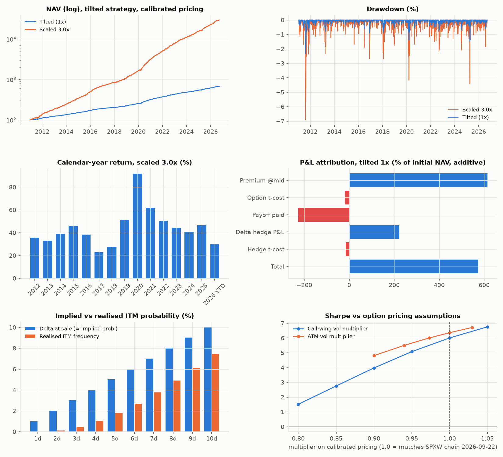
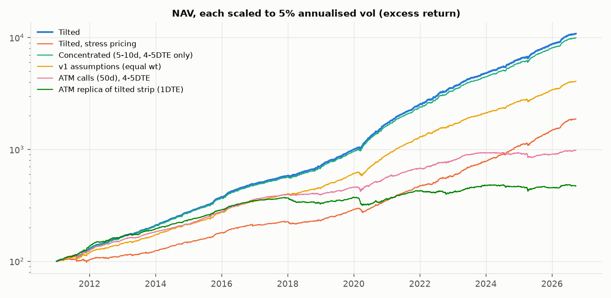

# SG_UFLY: Upside Vol Premium backtest (short-dated far-OTM SPX calls)

A simulation of a systematic **upside volatility premium** strategy:

> On every roll date the strategy sells deep OTM **1-delta to 10-delta calls** across four
> short-dated listed expiries (**2, 3, 4, 5 DTE**) and **delta-hedges every hour**. Calls are
> **held to maturity**.

- **Original design:** 25% on each expiry and equal weight on each strike.
- **Tilted design (headline):** 80% of strike notional on 5–10-delta (1–4-delta get 5% each)
  and 70% of roll notional on 4–5DTE (weights 15/15/35/35 on 2/3/4/5DTE).

Backtest window: **3 Jan 2011 – 22 Sep 2026** (3,953 SPX trading days). Pricing is calibrated
to a real SPXW option chain (see "Pricing, v2").



## Headline results

Returns are excess returns (collateral interest is not included). "1x" sells 1x NAV of notional
per daily roll, about 3.9x NAV of short calls outstanding. "Ret @5% vol" is the return scaled to
5% annualised volatility, so rows can be compared directly.

| Scenario | CAGR % | Vol % | Sharpe | Ret @5% vol | Max DD % | Worst day % |
|---|---:|---:|---:|---:|---:|---:|
| **Tilted** (hourly hedge, calibrated pricing) | **12.9** | 2.0 | **6.0** | 30.0 | -2.3 | -1.5 |
| Tilted, scaled 3x (~6% vol) | 43.7 | 6.1 | 6.0 | 30.0 | -6.9 | -4.6 |
| **Tilted, stress pricing** (see below) | 5.9 | 1.5 | **3.8** | 18.8 | -2.8 | -1.1 |
| Original design, equal weights | 10.0 | 1.6 | 6.1 | 30.4 | -1.8 | -1.2 |
| Concentrated (5–10-delta and 4–5DTE only) | 17.0 | 2.7 | 5.9 | 29.5 | -3.0 | -2.0 |
| Tilted, hedged once a day (close) | 11.2 | 2.6 | 4.1 | 20.4 | -3.3 | -2.1 |
| Tilted, unhedged | 9.1 | 2.9 | 3.0 | 15.0 | -4.4 | -3.8 |
| Tilted, only expiries actually listed at the time | 12.0 | 1.9 | 5.9 | 29.5 | -1.9 | -1.2 |
| **ATM calls** (50-delta, 4–5DTE), hourly hedge | 24.5 | 7.6 | 2.9 | 14.7 | -15.4 | -6.2 |
| **ATM replica** of the tilted strip (1DTE ATM, gamma-matched) | 3.0 | 1.5 | 2.0 | 10.0 | -4.9 | -1.1 |
| v1 assumptions (first run, uncalibrated) | 8.3 | 1.7 | 4.75 | 23.8 | -2.6 | -1.2 |



Full tables are in [`results/RESULTS_TABLES.md`](results/RESULTS_TABLES.md): yearly returns, P&L
attribution, results by delta and tenor, sub-periods, pricing sensitivity, the chain check, the
gap stress test and the worst days.

## Why the numbers look too good, and what's left once you correct for it

**1. v1 overpriced the options. That's fixed.** On the 22 Sep 2026 SPXW chain, v1 priced the
5–10-delta strip at about **2x the real bid**. There were three causes:
- VolVue's `SPX` ticker is the *monthly* options root, so its "10-day" ATM vol actually comes from
  the nearest monthly expiry (11.25 vs 10.35 for `SPXW`).
- 2–5-day options trade below 10-day vol: VIX1D is about 0.86 × VIX9D.
- Weekends were given too much variance.

v2 uses VolVue `SPXW`, a short-end factor from VIX1D/VIX9D, a weekend weight fitted to the
chain, and a call wing fitted to the chain. The model now matches market bids: premium-weighted
market/model bid = **0.999**.

**2. After calibration, the edge got larger, not smaller.** Relative to ATM, the real market's
call wing is *richer* than v1 assumed: a 10-delta call trades at 1.01 × ATM and a 1-delta call
at 1.16 × ATM (v1 assumed 0.92 and 1.02). The realised SPX upside is much thinner than that
pricing implies:

| Delta at sale | 2d | 3d | 4d | 5d | 6d | 7d | 8d | 9d | 10d |
|---|---:|---:|---:|---:|---:|---:|---:|---:|---:|
| Realised ITM frequency | 0.1% | 0.5% | 1.0% | 1.8% | 2.7% | 3.8% | 4.9% | 6.1% | 7.5% |

This agrees with academic evidence that OTM index calls are systematically overpriced
(for example Bakshi, Madan & Panayotov, 2010). The *direction* of the edge is well supported.

**3. What is still optimistic, and can't be fixed without historical chain data:**
- **Wing pricing is anchored to one calm day (22 Sep 2026) and applied to all 15 years.** In
  stress, and before the 2022 0DTE boom, the call wing was probably cheaper. The *stress pricing*
  scenario uses:
  - a wing 10% cheaper before May 2022;
  - a wing that gets cheaper as vol rises (−0.5 × (ATM − 12%), floored at 0.75);
  - ATM × 0.94;
  - high transaction costs.

  That cuts the Sharpe to **3.8**. Each 5% cheaper wing costs about 1.1 points of Sharpe
  (wing × 0.85 gives Sharpe 2.8; × 0.80 gives 1.5).
- **The Sharpe hides a tail the sample never delivered.** Hourly hedging can't react to an
  **overnight gap**. The gap stress test below applies an instant move to every day's closing
  book.

**Gap stress test, tilted book, loss in % of NAV** (full table in RESULTS_TABLES.md):

| Instant SPX move | +3% | +5% | +8% | +12% | -10% |
|---|---:|---:|---:|---:|---:|
| 1x, median day | -2.5 | -8.7 | -19 | -34 | -1.5 |
| 1x, calm-market median (2d ATM < 12%) | -4.1 | -11.0 | -22 | -36 | -1.7 |
| 3x (~6% vol), calm-market median | -12 | -33 | -65 | -109 | -4.9 |

Since 2017, the largest SPX overnight up-gaps were +4.8%, +3.6% and +3.0%. All of them came in
high-vol regimes, when strikes were far away. **A +5% overnight gap in a calm market has never
happened in the sample, but it would cost a third of NAV at 6% vol.** That, not the realised
drawdown, is what should set the size.

## Can you sell ATM and dynamically adjust to make an "artificial" 5–10-delta?

**Not in a way that keeps the premium.**

- A delta-hedged option earns roughly the sum of ½·Γ·S²·(σ²_implied − σ²_realised) over its life.
  Delta hedging (trading futures) only changes **delta**. It can't move where the **gamma** and
  vega sit, which is at the option's strike. So short ATM plus dynamic hedging gives short gamma
  at spot, in both directions, not the upside-strike exposure.
- Recreating a 5–10-delta call's payoff purely by trading futures earns **no premium**. You get
  paid σ_implied only if you actually sell the option; a synthetic position is "sold" at realised vol.
- The closest you can get is to sell ATM options each day, sized to match the strip's dollar gamma
  (**ATM replica**). That earns the *ATM* implied vol on the strip's gamma path. It gives up the
  wing premium, which is the whole edge, and it sells cheaper right after rallies, because ATM vol
  falls as SPX rises (spot-vol beta about −5).
- **Tested:** the ATM replica gets Sharpe 2.0 and 10%/yr at 5% vol, flat since 2022. Plain ATM
  calls get Sharpe 2.9, 15%/yr at 5% vol, a −15% drawdown and down years in 2024 and 2025. The
  real 5–10-delta strip gets Sharpe 6.0 and 30%/yr at 5% vol.
  **The premium lives in the far-OTM wing, not at the money.** If execution in the wing is the
  worry, the tilt to 5–10-delta (more liquid, less affected by the 0.05 tick) is the right
  compromise, not ATM.

## Conclusions you can act on

1. **The tilt doesn't raise the Sharpe** (6.0 vs 6.1 for equal weights). It earns more premium
   per unit of notional, with proportionally more risk (12.9% vs 10.0% CAGR; 2.0% vs 1.6% vol).
   Use it for capital efficiency and liquidity, not as a source of extra edge. Going all the way
   (5–10-delta and 4–5DTE only) behaves the same (Sharpe 5.9).
2. **Size to the gap stress, not to the backtest vol.** If a +5% calm-market overnight gap should
   cost no more than about 10% of NAV, run about 1x notional per roll (about 2% vol and 13%/yr
   modelled, 6%/yr under stress pricing). Running 3x for 6% vol means a +5% gap costs about a third.
3. **Keep hourly hedging.** Sharpe is 6.0 hourly, 4.1 with once-a-day hedging and 3.0 unhedged.
4. **Don't replace the wing with ATM.** It gives up most of the edge (see above).
5. **Watch the wing premium every day.** Run `python validate_chain.py`: it snapshots the CBOE
   SPXW chain and prints market/model bids and the fitted wing (10-delta and 1-delta vol / ATM).
   If the 10-delta call vol falls toward about 0.85 × ATM, the edge roughly halves (Sharpe about 2.8).
6. **The next real validation step is historical SPXW end-of-day quotes** (CBOE DataShop,
   OptionMetrics, ORATS), to replace the modelled surface for 2011–2026. Until then, treat
   Sharpe 6 as an upper bound, and the stress-pricing case (3.8) as a more realistic but still
   pre-cost-of-tail figure.
7. **A gap hedge is worth testing next.** Buying further-OTM calls against the short strip
   (a call spread, or an upside "fly") caps the overnight-gap loss. It costs part of the premium,
   because the far wing is expensive (1-delta at 1.16 × ATM, and more below 1 delta).

## Pricing, v2 (calibrated)

| Component | Implementation |
|---|---|
| ATM level | **VolVue `SPXW` 10-day ATM mean IV**. Before Apr 2014 the `SPX` root is used; bad prints are replaced by VIX9D × the local ratio. It is converted to business time over the exact 10-calendar-day window. |
| Short end | The option's ATM vol = 10-day level × k(T). The first day's variance is VIX1D²/VIX9D² of the average, and the remaining days are rescaled so the 10-day total is unchanged. VIX1D is used from Apr 2023; before that the median ratio of 0.86 is used. |
| Weekends | Priced at 0.05 of a trading day's variance. The chain fit gives 0–0.05; realised SPX gives 0.02–0.07. |
| Call wing | Quadratic in z = ln(K/F)/(σ_ATM√T), anchored at 10-delta = **1.01 × ATM** and 1-delta = **1.16 × ATM**, fitted to the SPXW chain. |
| Level fit | ATM × **0.973** so model bids equal market bids on the 22 Sep 2026 chain (`validate_chain.py --calibrate`). |
| Intraday vol | The open level (previous close × the VIX9D open move), then a spot-vol beta: −5 on rallies, −7 on sell-offs. |
| Execution | Sell at mid − max(0.025, 3% × mid). A strike isn't sold if its bid is below 0.05. |

## How the simulation works

| Component | Implementation |
|---|---|
| Underlying | SPX, daily OHLC (Yahoo). Real **hourly bars from Oct 2023**. Earlier hourly marks are synthetic, bridged between the real open and close with intraday variance from the day's high/low. On overlapping days this was about 0.5%/yr more flattering than real bars (checked in v1). |
| Roll | Every trading day at the close. Sells expiries d+2 to d+5 trading days, strikes on the 5-point grid at the target deltas. |
| Settlement | Held to expiry, cash-settled on the official close (SPXW PM). |
| Delta hedge | Rebalanced at the open, 10:30 … 15:30 and the close to the Black-Scholes delta at the smile vol. Uses SPX/ES as a zero-carry future, costing 0.15 index points per unit traded. |
| ATM replica | The strip is virtual. Each close the engine sells 1DTE ATM calls, with quantity = the strip's dollar gamma / ATM gamma, and hedges them hourly. |
| Gap stress | Each close, the book is repriced after an instant spot move (vol shifted by the spot-vol beta). |

### Limitations

- There are no historical strike-level SPXW quotes. The surface is modelled and anchored to one
  real chain.
- The wing premium relative to ATM is static, apart from the stress scenario.
- Before May 2022 SPX didn't list every weekday expiry. The base case assumes it did; the
  "listed expiries only" scenario uses the real calendar.
- Margin, financing and collateral yield are ignored.

## Run it

```bash
pip install -r requirements.txt
export VOLVUE_API_KEY=...            # VolVue ATM vols (falls back to the VIX9D proxy)
python run_backtest.py               # downloads data to ./data on first run, writes ./results
python validate_chain.py             # today's CBOE SPXW chain vs the model (saved to data/chains/)
python validate_chain.py --file data/chains/spx_YYYY-MM-DD.json --calibrate
```

Code layout:

- `ufly/data.py`: Yahoo data (SPX daily/hourly, VIX9D, VIX1D), cleaning, VolVue merge
- `ufly/volvue.py`: VolVue API client (`api.volvue.com/query`)
- `ufly/vol.py`: Black-Scholes, smile model, strike-for-delta, business-time variance clock
- `ufly/paths.py`: hourly marks (real or bridged)
- `ufly/backtest.py`: strategy engine (`Config` holds every parameter; strip or ATM-replica mode, gap stress)
- `ufly/metrics.py`: performance statistics
- `run_backtest.py`: scenarios, tables and charts
- `validate_chain.py`: model vs real SPXW chain, and ATM-level calibration

Raw market data (`data/`, including chain snapshots) is git-ignored and not redistributed.
